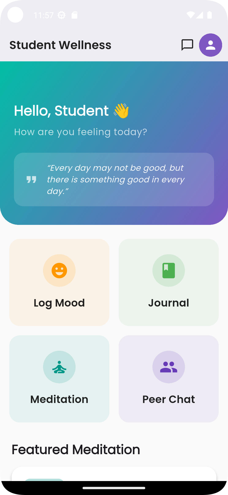
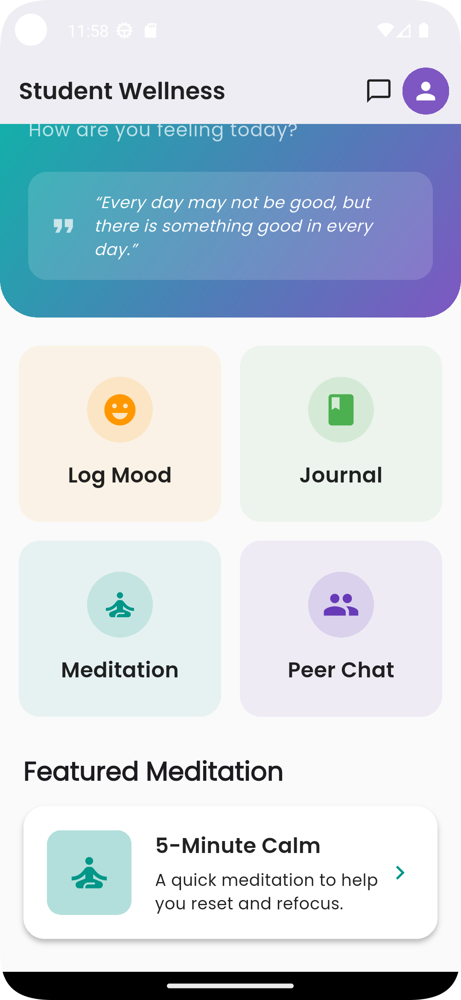
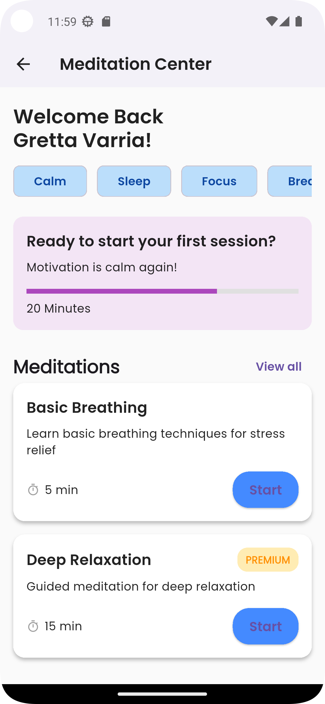
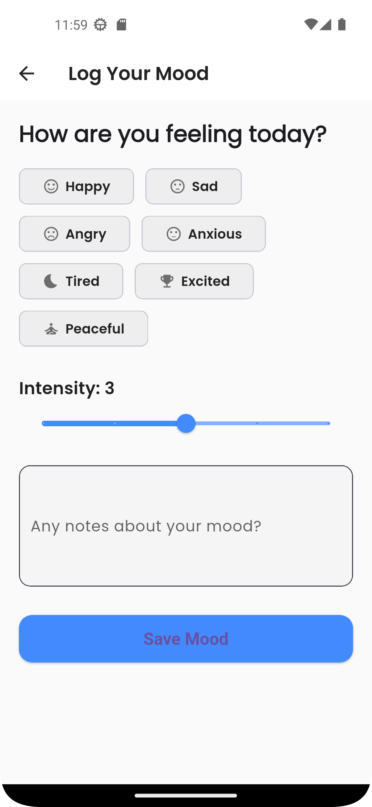
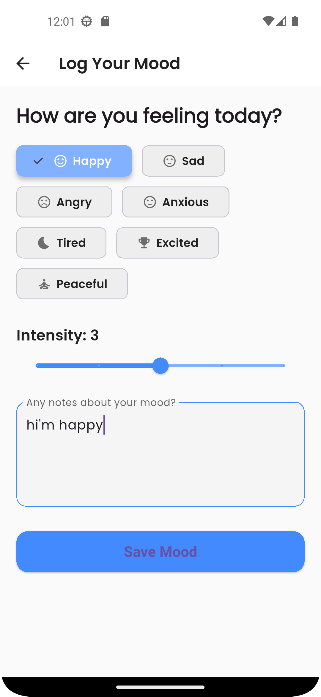
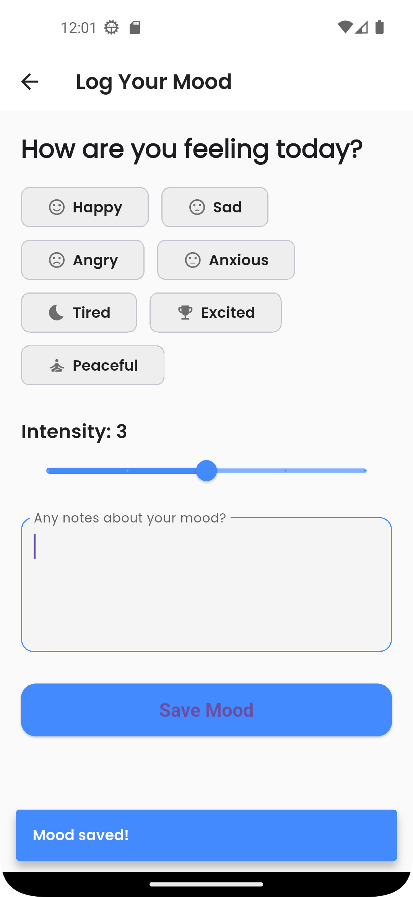
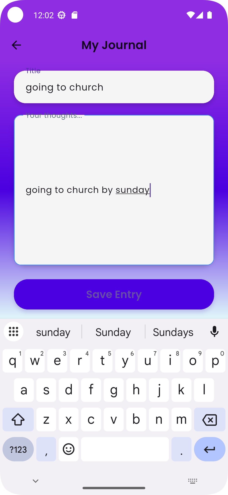
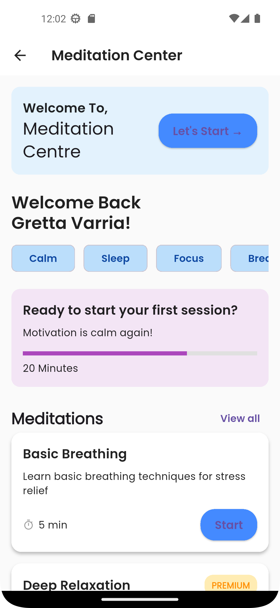
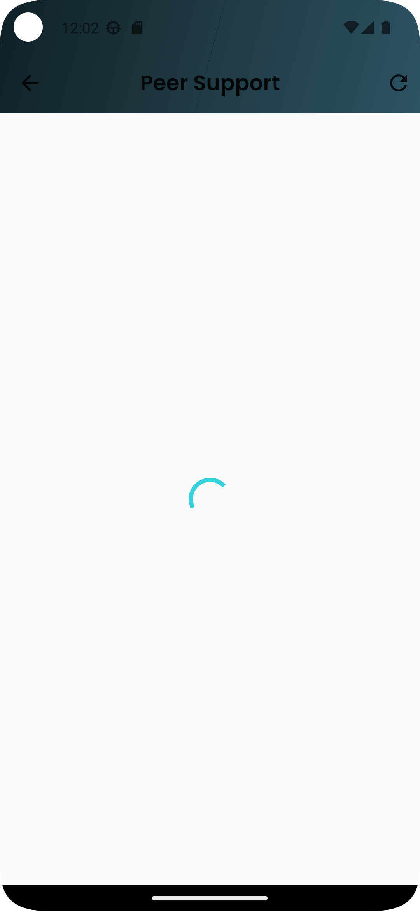

# Student Mental Wellness & Peer Support App

A Flutter mobile application designed to help students track their moods, write journal entries, and connect with peer support groups. This project fulfills the requirements for the Student Mental Wellness & Peer Support App as outlined in the course project brief.

---

## Table of Contents
- [Project Overview](#project-overview)
- [Core Features](#core-features)
- [Screenshots](#screenshots)
- [Getting Started](#getting-started)
- [Offline Storage & Backend](#offline-storage--backend)
- [Project Structure](#project-structure)
- [Dependencies](#dependencies)
- [Customization](#customization)
- [Contributing](#contributing)
- [License](#license)

---

## Project Overview
This app is built to support student mental wellness by providing tools for mood tracking, journaling, guided meditation, and anonymous peer support chat. It also integrates emergency contact access for immediate help.

---

## Core Features
- **Mood Tracking & Journaling:** Log daily moods, rate intensity, and write personal reflections. Journals and mood logs are stored locally and in the cloud for backup.
- **Anonymous Peer Support Chat:** Secure, anonymous chat system for students to support each other.
- **Guided Meditation & Stress Relief:** Access guided meditation sessions and breathing exercises for relaxation.
- **Emergency Contact Integration:** Quick access to university counselors and emergency helplines, plus step-by-step emergency protocols.
- **Offline Storage:** Uses SharedPreferences for local storage of journals and mood logs, ensuring access even without internet.

---

## Screenshots


*Home Screen*


*Mood Tracker*


*Journal Entry Screen*


*Peer Support Chat*


*Guided Meditation*


*Emergency Contacts*


*Profile Screen*


*App Settings*


*Statistics & Insights*


*Additional Feature Screen*

---

## Getting Started

### Prerequisites
- [Flutter SDK](https://flutter.dev/docs/get-started/install)
- [Dart SDK](https://dart.dev/get-dart)
- A Firebase project (for authentication and cloud backup)

### Installation
1. **Clone the repository:**
   ```sh
   git clone <repo-url>
   cd student_wellness_app
   ```
2. **Install dependencies:**
   ```sh
   flutter pub get
   ```
3. **Firebase Setup:**
   - Add your `google-services.json` to `android/app/` (for Android)
   - Add your `GoogleService-Info.plist` to `ios/Runner/` (for iOS)
   - Generate `lib/firebase_options.dart` using the [FlutterFire CLI](https://firebase.flutter.dev/docs/cli/):
     ```sh
     flutterfire configure
     ```
   - Enable **Authentication** and **Cloud Firestore** in your Firebase Console.
4. **Run the app:**
   ```sh
   flutter run
   ```

---

## Offline Storage & Backend
- **Offline Storage:** The app uses SharedPreferences for storing journals and mood logs locally on the device.
- **Cloud Backup:** Firebase Authentication and Firestore are used for user management and cloud backup of data.

---

## Project Structure
```
lib/
  main.dart                # App entry point
  models/                  # Data models (mood, journal, user, chat, etc.)
  providers/               # State management (Provider)
  screens/                 # UI screens (home, mood, journal, chat, etc.)
  services/                # Business logic and integrations (Firebase, notifications, etc.)
  theme/                   # App theming and colors
  widgets/                 # Reusable UI components
```

---

## Dependencies
- `provider` for state management
- `firebase_core`, `firebase_auth`, `cloud_firestore` for backend
- `shared_preferences` for offline storage
- `flutter_local_notifications` for reminders
- `flutter_chat_ui` for chat interface
- `google_fonts`, `animations`, and more (see `pubspec.yaml`)

---

## Customization
- **Firebase:** Replace the included Firebase config files with your own for production.
- **Branding:** Update app icons and splash screens in the `android`, `ios`, and `web` folders.
- **Emergency Contacts:** Edit `lib/screens/emergency_screen.dart` to customize contacts and protocols.

---

## Contributing
Pull requests are welcome! For major changes, please open an issue first to discuss what you would like to change.

---

## License
[MIT](LICENSE) *(or your preferred license)*
